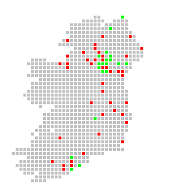

Irishgrid v0.3 - Irish Grid Mapping System

October 2009


#IrishGrid

##Description

Perl module for creating geographic 10km-square maps using either SVG or PNG (with GD library) output format.

Originally design to map the location of objects in a 10 km map IrishGrid includes:

 *  native support of the Irish Grid System (see [http://www.osi.ie/](http://www.osi.ie/))
 *  optimise for speed (there's as less as possible data to conversion)
 *  customised color functions 

As input file, IrishGrid uses a text comma separated format (CSV). Each line represents a record (in chronological order). The first field defined the colour (red, green, blue, black, grey, white), the second the position (using the Irish Grid System).

```
example.csv

blue, O008741
red, C948454
...
```

##Examples

```
# SVG file
./irishgrid.pl --in=example.csv --svg > mymap.svg

# PNG file with 10 pixels squares
./irishgrid.pl --in=example.csv --size=10 > mymap.png
```


